<div align="center">

# Metasploitable 2: Vulnerability Assessment & Packet Analysis Lab

Nmap, Nessus and Nikto scans, plus Wireshark traffic analysis, of a deliberately vulnerable VM.
Write-up of two tasks from the Progree Cyber Security Internship.


[Overview](#overview) · [Results](#results-at-a-glance) · [Lab setup](#lab-setup) · [Task 2](#task-2--vulnerability-assessment) · [Task 3](#task-3--packet-analysis) · [Limitations](#limitations-and-open-questions) · [Structure](#repository-structure)

</div>

---

## Overview

This repository documents hands-on work from the Progree Remote Internship in Cyber Security (Progree, Islamabad; 20 September to 20 October 2026). Both tasks were run from a Kali Linux machine against one practice target, Metasploitable 2 at `10.0.0.16`.

| Task | What it covers |
| --- | --- |
| **Task 2: Host & network vulnerability assessment** | Find open ports and service versions with Nmap, scan the target with Nessus and Nikto, match versions to known CVEs, and rank what to fix first. |
| **Task 3: Packet inspection & protocol analysis** | Capture traffic with Wireshark and look at a port scan, a TCP handshake, clear-text HTTP and FTP logins, and a simulated 10 MB data exfiltration. |

There is no application code here. The repository is the write-up: one screenshot per step, the commands those screenshots show, and a note on what each one does and does not prove. The complete written report is in [`docs/report/`](docs/report/).

It is meant for people learning the same workflow on a target they are allowed to test, and for the Progree reviewers who assessed the tasks.

> **Authorised use only.** Everything here was run against a VM built to be attacked. Do not point these tools at systems you do not own or have written permission to test.

Figure numbers match the written report, so each screenshot can be cross-checked against it.

**†** marks a statement that comes from the written report and is **not visible in any screenshot**.

## Results at a glance

| Area | Result | Evidence |
| --- | --- | --- |
| Open TCP ports | Nmap reported 30 open ports (65,505 closed). The screenshot lists the first 22. | Figure 6 |
| Nessus scan | 193 findings: 10 Critical, 3 High†, 32 Medium, 8 Low, 140 Info. Unauthenticated, 22 minutes. | Figures 7, 8 |
| Nikto scan | Web server on port 80: TRACE enabled, missing security headers, `phpinfo.php` exposed, directory indexing, outdated Apache and PHP. The report counts 31 findings†. | Figure 9 |
| FTP credentials | Username and password (`msfadmin` / `msfadmin`) readable in clear text in the packet bytes. | Figures 18, 19 |
| Simulated exfiltration | A 10 MB file uploaded over FTP shows up as a one-way stream of large segments. | Figures 21 to 23 |

From the Nessus results in the report†, the items rated most serious were a root bind shell on port 1524, a backdoored UnrealIRCd on 6667 (CVE-2010-2075), a VNC service on 5900 that accepted a trivial password, predictable Debian OpenSSL keys (CVE-2008-0166), and end-of-life Ubuntu 8.04 and Tomcat 5.5. The per-finding Nessus screens are not part of the screenshot set.

## Lab setup

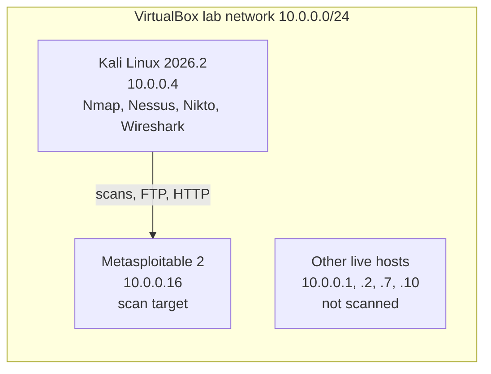
```mermaid
flowchart LR
    subgraph NET["VirtualBox lab network 10.0.0.0/24"]
        K["Kali Linux 2026.2<br/>10.0.0.4<br/>Nmap, Nessus, Nikto, Wireshark"]
        T["Metasploitable 2<br/>10.0.0.16<br/>scan target"]
        O["Other live hosts<br/>10.0.0.1, .2, .7, .10<br/>not scanned"]
    end
    K -- "scans, FTP, HTTP" --> T
```

| Item | Details | Source |
| --- | --- | --- |
| Analyst machine | Kali Linux 2026.2 in VirtualBox†, `10.0.0.4`, MAC `08:00:27:3d:4d:96` | Figure 14 (MAC) |
| Target | Metasploitable 2, `10.0.0.16`, MAC `08:00:27:59:5b:04`; Ubuntu 8.04 per the report† | Figure 15 (MAC) |
| Nmap | 7.99 | Figure 6 |
| Nessus | Tenable Nessus Expert 10.12.4, free trial, "Basic Network Scan" policy, local scanner | Figures 2, 4, 7 |
| Nikto | 2.6.1 | Figure 9 |
| Wireshark | 4.6.6, capturing on `eth0` | Figure 10 |

Scope: every scan was aimed at `10.0.0.16` only†. In Task 2 I identified vulnerabilities but did not exploit any†. Task 3 was a passive capture plus a few deliberate actions to create traffic: three FTP logins (one failed with the wrong username, two successful with the default `msfadmin` account), a refused netcat attempt, and a 10 MB FTP upload.

## Requirements

To repeat the lab you need:

- Kali Linux (2026.2 here) in VirtualBox
- Metasploitable 2 on the same virtual network as Kali
- Nmap, Nikto and Wireshark
- Tenable Nessus (Expert trial); the trial needs an activation code sent by email
- `zypper`, which was not installed on Kali and had to be added first (see [2.1](#21-install-and-activate-nessus))

How the VirtualBox network adapters were configured is not documented in the evidence, so it is not described here.

---

## Task 2 · Vulnerability assessment

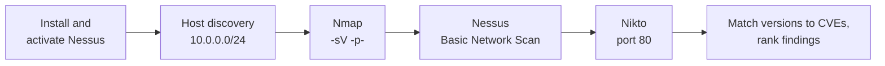
```mermaid
flowchart LR
    A["Install and<br/>activate Nessus"] --> B["Host discovery<br/>10.0.0.0/24"]
    B --> C["Nmap<br/>-sV -p-"]
    C --> D["Nessus<br/>Basic Network Scan"]
    D --> E["Nikto<br/>port 80"]
    E --> F["Match versions to CVEs,<br/>rank findings"]
```

### 2.1 Install and activate Nessus

```bash
# zypper was missing; Kali's "command not found" hint suggested this
sudo apt install zypper

# install the package downloaded from Tenable
sudo dpkg -i Nessus-10.12.4-debian10_amd64.deb
```

Nessus then asks for an activation code by email. I used a disposable address for the trial†. After activation it opens at `localhost:8834` and compiles plugins before it is fully usable. The command that starts the Nessus service is not visible in any screenshot.

<details>
<summary><b>Show setup screenshots (Figures 1 to 4)</b></summary>

<table>
<tr>
<td width="50%" valign="top">
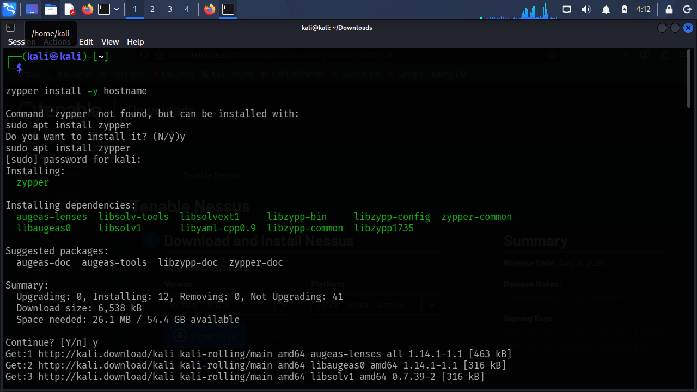<br>
<sub><b>Figure 1.</b> <code>zypper</code> is not installed on Kali. The command-not-found hint suggests <code>sudo apt install zypper</code>; it is accepted and 12 packages are installed. The command originally typed was <code>zypper install -y hostname</code>.</sub>
</td>
<td width="50%" valign="top">
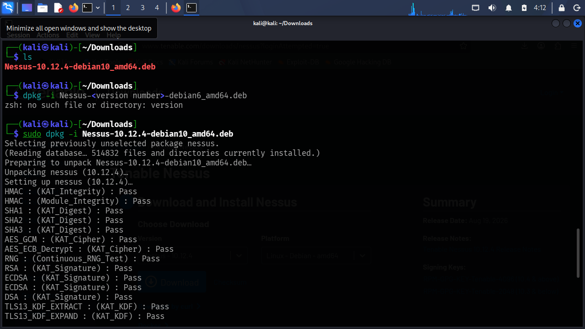<br>
<sub><b>Figure 2.</b> Installing <code>Nessus-10.12.4-debian10_amd64.deb</code> with dpkg. A first attempt using the docs' placeholder filename failed; the <code>sudo</code> run sets up nessus 10.12.4 and every self-test line visible reports Pass.</sub>
</td>
</tr>
<tr>
<td width="50%" valign="top">
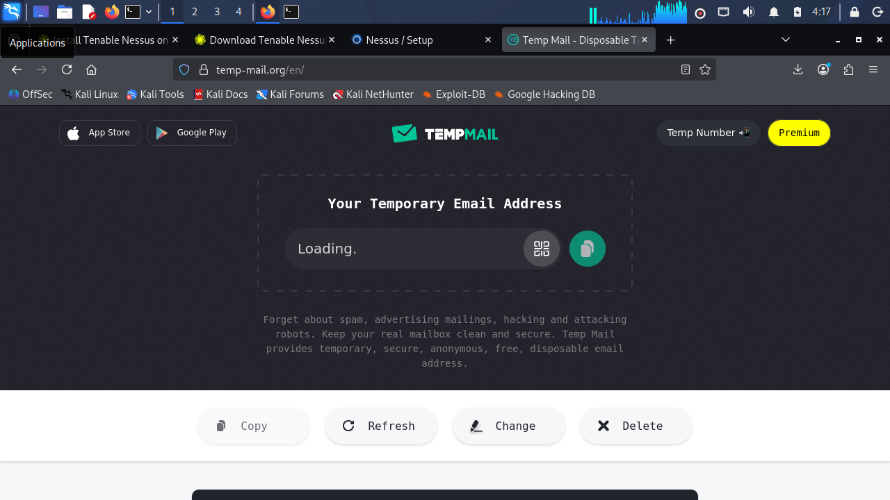<br>
<sub><b>Figure 3.</b> temp-mail.org open in Firefox beside the "Nessus / Setup" tab, used to receive the trial activation email. The address field still reads "Loading." in this capture, so no address is visible.</sub>
</td>
<td width="50%" valign="top">
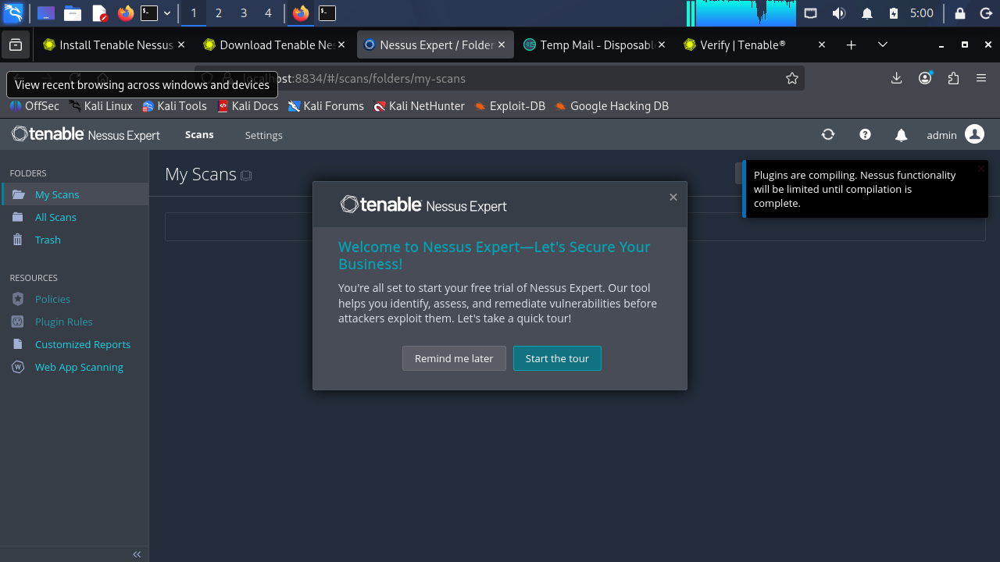<br>
<sub><b>Figure 4.</b> Nessus Expert first run on <code>localhost:8834</code>: free-trial welcome dialog, and a notice that plugins are compiling and functionality is limited until that finishes.</sub>
</td>
</tr>
</table>

</details>

### 2.2 Discover live hosts

Nessus host discovery was run against `10.0.0.0/24`. Six hosts answered. I scanned only `10.0.0.16`†.

<p align="center">
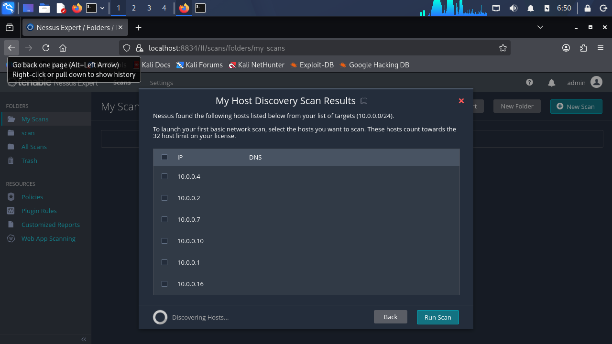<br>
<sub><b>Figure 5.</b> Nessus host discovery for <code>10.0.0.0/24</code>: 10.0.0.4, .2, .7, .10, .1 and .16. The footer still says "Discovering Hosts…" and no host is ticked yet, so this shows the discovered list, not the final target selection.</sub>
</p>

### 2.3 Map open ports and versions with Nmap

```bash
nmap -sV -p- 10.0.0.16
```

<p align="center">
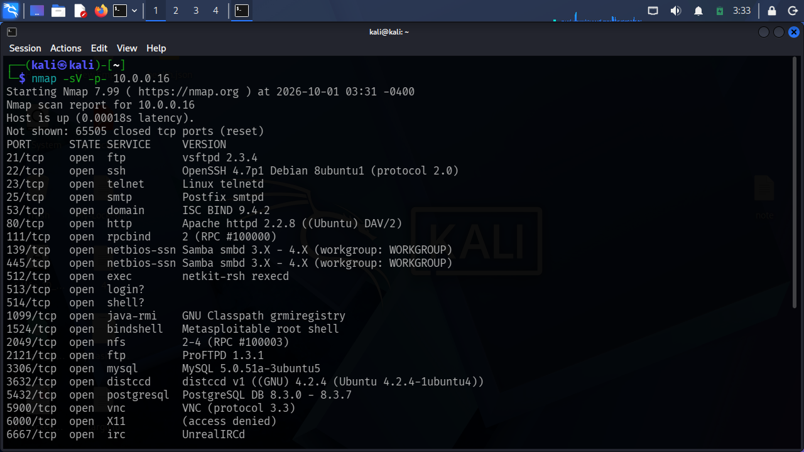<br>
<sub><b>Figure 6.</b> Nmap 7.99 full-port service scan of <code>10.0.0.16</code> (started 2026-10-01 03:31 -0400). Host is up; 65,505 closed ports not shown. The screenshot ends at port 6667, which is the 22nd of the 30 open ports.</sub>
</p>

<details>
<summary><b>Open ports visible in Figure 6 (22 of 30)</b></summary>

| Port | Service | Version reported by Nmap |
| --- | --- | --- |
| 21/tcp | ftp | vsftpd 2.3.4 |
| 22/tcp | ssh | OpenSSH 4.7p1 Debian 8ubuntu1 (protocol 2.0) |
| 23/tcp | telnet | Linux telnetd |
| 25/tcp | smtp | Postfix smtpd |
| 53/tcp | domain | ISC BIND 9.4.2 |
| 80/tcp | http | Apache httpd 2.2.8 ((Ubuntu) DAV/2) |
| 111/tcp | rpcbind | 2 (RPC #100000) |
| 139/tcp | netbios-ssn | Samba smbd 3.X - 4.X (workgroup: WORKGROUP) |
| 445/tcp | netbios-ssn | Samba smbd 3.X - 4.X (workgroup: WORKGROUP) |
| 512/tcp | exec | netkit-rsh rexecd |
| 513/tcp | login? | (no version) |
| 514/tcp | shell? | (no version) |
| 1099/tcp | java-rmi | GNU Classpath grmiregistry |
| 1524/tcp | bindshell | Metasploitable root shell |
| 2049/tcp | nfs | 2-4 (RPC #100003) |
| 2121/tcp | ftp | ProFTPD 1.3.1 |
| 3306/tcp | mysql | MySQL 5.0.51a-3ubuntu5 |
| 3632/tcp | distccd | distcc v1 ((GNU) 4.2.4 (Ubuntu 4.2.4-1ubuntu4)) |
| 5432/tcp | postgresql | PostgreSQL DB 8.3.0 - 8.3.7 |
| 5900/tcp | vnc | VNC (protocol 3.3) |
| 6000/tcp | X11 | (access denied) |
| 6667/tcp | irc | UnrealIRCd |

The report adds three higher ports taken from the Nessus port list†: 8009 (Apache Tomcat AJP13), 8180 (Apache Tomcat 5.5) and 8787 (Ruby DRb). That makes 25 documented ports; the other 5 open ports were not captured. The Nmap output was not saved to a file.

</details>

### 2.4 Scan with Nessus

Scan name `progree tasks`, policy **Basic Network Scan**, local scanner, target `10.0.0.16`. The scan was unauthenticated, which is why the Auth column reads **Fail**: Nessus looked at the machine from the network only and could not run local patch checks.

<table>
<tr>
<td width="50%" valign="top">
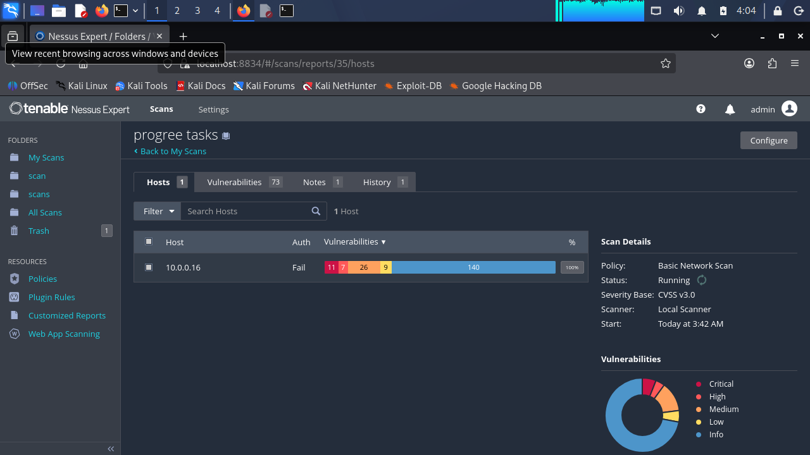<br>
<sub><b>Figure 7.</b> The scan while <b>Running</b> (started 3:42 AM). Provisional bar labels: 11 Critical, 7 High, 26 Medium, 9 Low, 140 Info. These change by the end.</sub>
</td>
<td width="50%" valign="top">
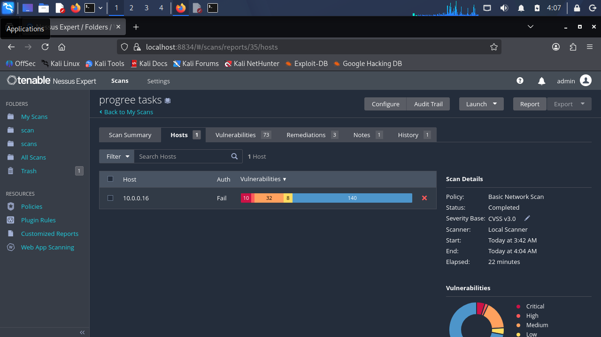<br>
<sub><b>Figure 8.</b> Same scan, <b>Completed</b> (3:42 to 4:04 AM, elapsed 22 minutes). Labelled bars: 10 Critical, 32 Medium, 8 Low, 140 Info. The High segment is too narrow to show its number; 3 comes from the report†.</sub>
</td>
</tr>
</table>

| Severity | Count | Share |
| --- | --- | --- |
| Critical | 10 | 5.2% |
| High | 3† | 1.6% |
| Medium | 32 | 16.6% |
| Low | 8 | 4.1% |
| Info | 140 | 72.5% |
| **Total** | **193** | |

Some findings repeat across ports (for example SMTP on 25 and PostgreSQL on 5432), so 193 counts findings, not distinct plugins.

<details>
<summary><b>Critical and High findings as recorded in the report†</b></summary>

None of these rows are visible in the screenshots. They are copied from the report's Nessus notes.

| Plugin | Finding (port) | CVSS v3 | Severity |
| --- | --- | --- | --- |
| 51988 | Bind Shell Backdoor Detection (1524/tcp). Nessus reported a root shell (uid=0). | 9.8 | Critical |
| 46882 | UnrealIRCd Backdoor Detection (6667/tcp), CVE-2010-2075 | 10.0 | Critical |
| 61708 | VNC Server 'password' Password (5900/tcp) | 10.0 | Critical |
| 32314, 32321 | Debian OpenSSH/OpenSSL weak random number generator (22, 25, 5432), CVE-2008-0166 | 10.0 | Critical |
| 171340 | Apache Tomcat SEoL <= 5.5.x (8180/tcp) | 10.0 | Critical |
| 201352 | Canonical Ubuntu Linux SEoL 8.04.x | 10.0 | Critical |
| 20007 | SSL Version 2 and 3 Protocol Detection (25, 5432) | n/a | Critical |
| 134862 | Apache Tomcat AJP "Ghostcat" (8009/tcp), CVE-2020-1938, CVE-2020-1745 | 9.8 | High |
| 10205, 10245 | rlogin and rsh service detection (513, 514), CVE-1999-0651 | 7.5 | High |

Two more entries in the report's CVE table, **vsftpd 2.3.4 (CVE-2011-2523)** and **distccd (CVE-2004-2687)**, come from public CVE lists, not from this Nessus run. They are marked "verify" and were not tested.

</details>

### 2.5 Scan the web server with Nikto

```bash
nikto -h http://10.0.0.16 -o /home/kali/nikto_scan.html -Format html
```

<p align="center">
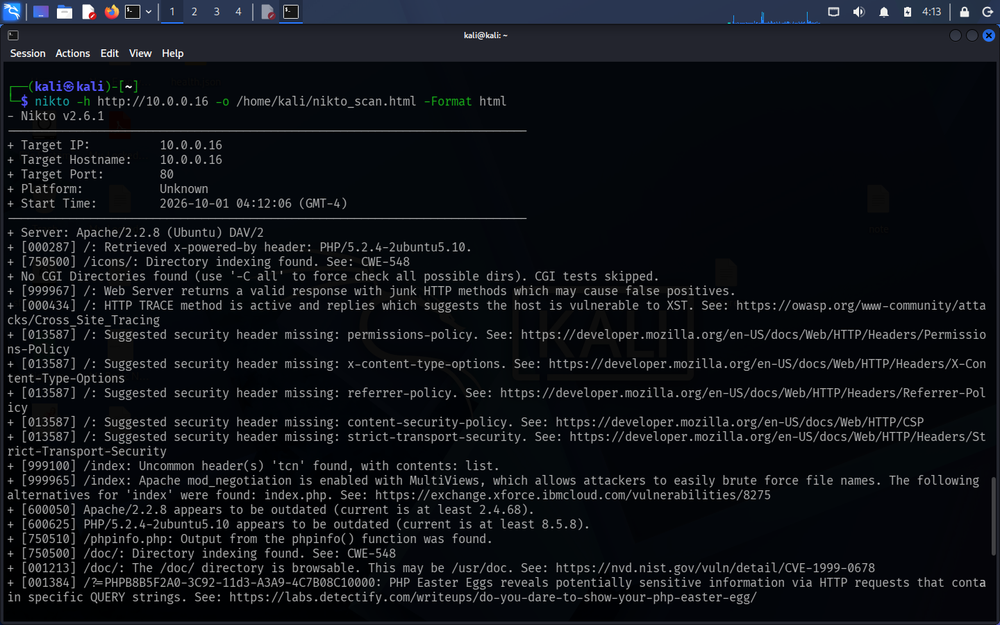<br>
<sub><b>Figure 9.</b> Nikto 2.6.1 against <code>http://10.0.0.16</code>, port 80, HTML report written to <code>/home/kali/nikto_scan.html</code> (start 2026-10-01 04:12:06 GMT-4). The terminal is cut off before Nikto's summary.</sub>
</p>

What is visible in Figure 9:

- `Server: Apache/2.2.8 (Ubuntu) DAV/2` and an `X-Powered-By: PHP/5.2.4-2ubuntu5.10` header
- Directory indexing on `/icons/` and `/doc/`
- HTTP TRACE is active, which Nikto links to cross-site tracing (XST)
- Five missing headers: `permissions-policy`, `x-content-type-options`, `referrer-policy`, `content-security-policy`, `strict-transport-security`
- `mod_negotiation` with MultiViews enabled, and an uncommon `tcn` header
- Apache 2.2.8 and PHP 5.2.4-2ubuntu5.10 flagged as outdated
- `/phpinfo.php` exposes `phpinfo()` output, and a PHP "Easter egg" query string returns information

The report also lists phpMyAdmin files, `/test/` indexing, 8,175 requests and 31 findings in 31 seconds†; those are past the point where the screenshot stops. Nikto does not assign severities, so any ratings in the report are my own judgement.

### 2.6 Triage

I ranked each finding on three questions: how high is the CVSS score, how easy is it to abuse (no password, no user action), and how exposed is the service†.

<details>
<summary><b>Fix priority from the report†</b></summary>

| Priority | Findings | Suggested action | Timeframe |
| --- | --- | --- | --- |
| Critical | Bind shell (1524), UnrealIRCd backdoor (6667), VNC password (5900), Debian weak keys (22, 25, 5432) | Isolate the host, remove the bind shell, reinstall UnrealIRCd from verified checksums, set a strong VNC password or close the port, regenerate keys and certificates | 0 to 24 hours |
| High | Tomcat Ghostcat (8009), rlogin/rsh (513, 514), vsftpd 2.3.4 and distcc (verify), end-of-life OS and Tomcat | Disable AJP or bind it to localhost, disable rlogin/rsh/rexec, replace or verify vsftpd and distccd, plan a rebuild on a supported OS | 7 days |
| Medium | World-readable NFS, Samba Badlock and SMB signing, BIND flaws, Telnet, phpinfo and phpMyAdmin exposure, TRACE | Restrict NFS exports, upgrade Samba and BIND, require SMB signing, replace Telnet with SSH, remove `phpinfo.php`, restrict phpMyAdmin, turn TRACE off | 30 days |
| Low | Weak TLS ciphers and certificates, weak SSH algorithms, missing headers, directory indexing, version banners | Disable SSLv2/v3 and TLS 1.0, drop weak ciphers, replace certificates, add security headers, switch off indexing, hide banners | 90 days |

</details>

Short version of the recommendations: take the host off shared networks, remove services that are not needed, replace clear-text protocols with SSH/SFTP and HTTPS, rebuild on a supported OS instead of patching Ubuntu 8.04, and rescan with credentials afterwards.

---

## Task 3 · Packet analysis

### 3.1 Start Wireshark

```bash
sudo wireshark
```

<table>
<tr>
<td width="50%" valign="top">
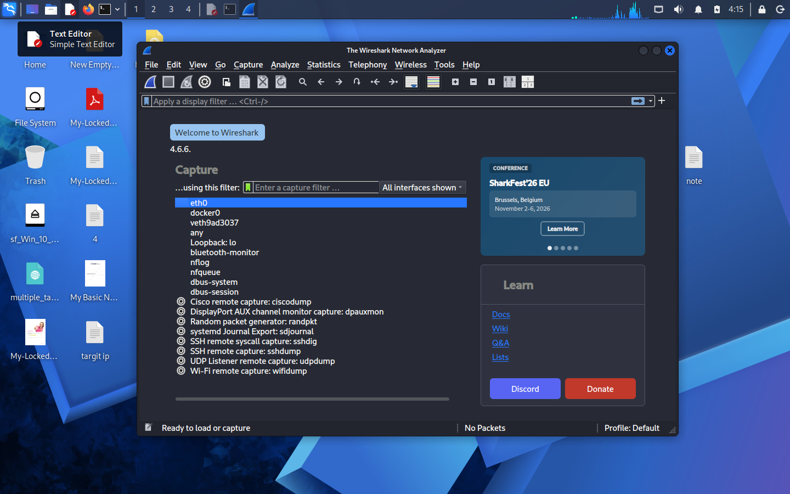<br>
<sub><b>Figure 10.</b> Wireshark 4.6.6 welcome screen on Kali. <code>eth0</code> is in the interface list; the status bar reads "No Packets".</sub>
</td>
<td width="50%" valign="top">
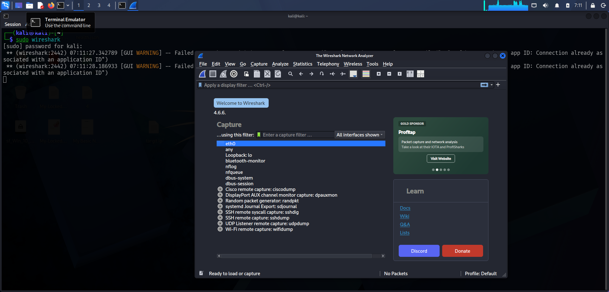<br>
<sub><b>Figure 11.</b> Wireshark started with <code>sudo wireshark</code>. <code>eth0</code> is highlighted but no capture has started. The two GUI warnings in the terminal are about an application ID.</sub>
</td>
</tr>
</table>

Figures 13 to 23 are consistent with a single capture, `wireshark_eth0JWT5V3.pcapng`. Its name is in the status bar of Figures 13 to 16, 22 and 23, and the packet totals only grow (277, 610, 1,118, 1,132, 1,189, 2,152). Figures 20 and 21 are terminal windows. Figure 12 does not show a filename and has a much higher packet count; see [Limitations](#limitations-and-open-questions).

Rough timeline of that capture, in seconds from its start:

| Time | What happens | Figure |
| --- | --- | --- |
| ~80 to 90 s | ICMP echo traffic and a DNS query | 13 |
| ~186 to 190 s | ICMP to an external address; ARP exchange | 14 |
| ~456 to 461 s | Reverse DNS lookup, TCP handshake to port 80 and close, ARP | 15 |
| ~493 s | Second connection to port 80: `GET /` | 16 |
| ~537 to 670 s | FTP sessions (failed login, successful login, `QUIT`) | 17 to 19 |
| ~991 s | FTP data upload of `/tmp/exfil.bin` | 22, 23 |

### 3.2 What a port scan looks like

<p align="center">
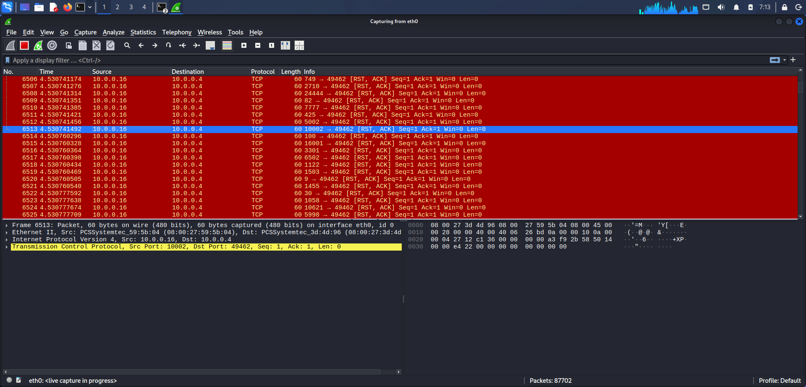<br>
<sub><b>Figure 12.</b> A burst of <code>[RST, ACK]</code> packets from <code>10.0.0.16</code> to <code>10.0.0.4</code> port 49462, each from a different source port (749, 2710, 10002, 16001 and so on), all with <code>Len=0</code>. Status bar: live capture on eth0, 87,702 packets.</sub>
</p>

A closed port answers an unwanted connection attempt with a reset, so a long run of resets from one host to one port is the usual footprint of a TCP port scan. This capture was taken while Nmap was probing the target†; the scan command itself is not in this screenshot.

### 3.3 Baseline traffic: ICMP, DNS and ARP

<table>
<tr>
<td width="50%" valign="top">
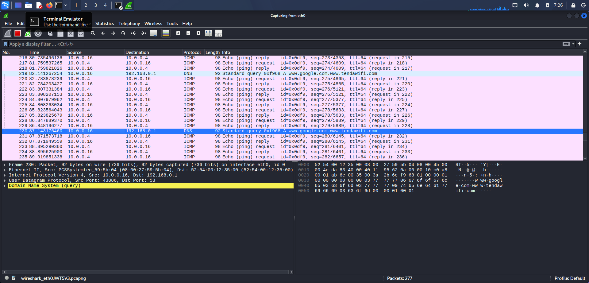<br>
<sub><b>Figure 13.</b> ICMP echo requests and replies between <code>10.0.0.4</code> and <code>10.0.0.16</code> (TTL 64), and a DNS query from <code>10.0.0.16</code> to <code>192.168.0.1</code>, UDP port 53, for <code>www.google.com.www.tendawifi.com</code>. 277 packets in the capture so far.</sub>
</td>
<td width="50%" valign="top">
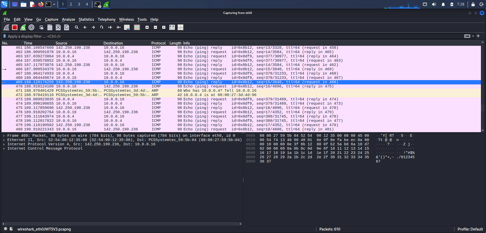<br>
<sub><b>Figure 14.</b> ICMP echo between <code>10.0.0.16</code> and the external address <code>142.250.190.236</code>, mixed with pings between the two lab hosts, plus an ARP pair: "Who has 10.0.0.4? Tell 10.0.0.16" answered by "10.0.0.4 is at 08:00:27:3d:4d:96". 610 packets so far.</sub>
</td>
</tr>
</table>

The ARP exchange the other way round, "Who has 10.0.0.16? Tell 10.0.0.4" answered by "10.0.0.16 is at 08:00:27:59:5b:04", is in the lower rows of Figure 15 (packets 1115 to 1118), next to a similar pair for `10.0.0.1`. ARP and DNS carry no authentication, so on a hostile network they can be forged. They are here as a baseline for the unusual traffic later.

### 3.4 The TCP three-way handshake

<p align="center">
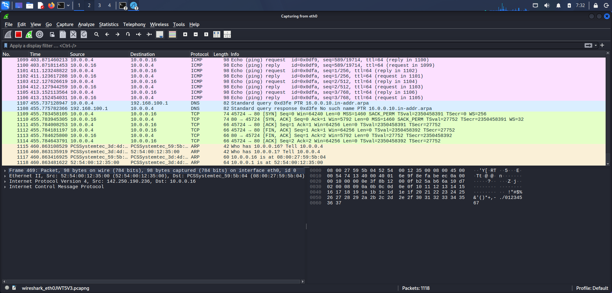<br>
<sub><b>Figure 15.</b> One connection from <code>10.0.0.4:45724</code> to <code>10.0.0.16:80</code>: SYN (1109), SYN/ACK (1110), ACK (1111), then FIN/ACK, FIN/ACK, ACK (1112 to 1114). Just above, a reverse DNS lookup for <code>16.0.0.10.in-addr.arpa</code> returns "No such name". The ARP rows at 1115 to 1118 are described in 3.3. The lower detail pane still shows an earlier packet (frame 469) and is unrelated.</sub>
</p>

- **SYN** (1109): sequence 0, window 64240, MSS 1460, SACK permitted
- **SYN/ACK** (1110): acknowledgement 1, window 5792
- **ACK** (1111): the connection is open
- **FIN/ACK, FIN/ACK, ACK** (1112 to 1114): both sides close it cleanly

A finished handshake like this is what a normal session looks like. The scan in Figure 12 never gets this far; the target just answers with resets.

### 3.5 Plain HTTP

<p align="center">
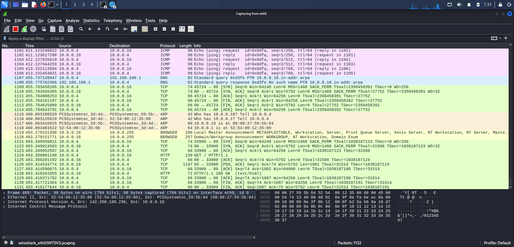<br>
<sub><b>Figure 16.</b> A second connection to port 80 (<code>33900 → 80</code>, about 493 s in): <code>GET / HTTP/1.1</code> (packet 1124) and <code>HTTP/1.1 200 OK (text/html)</code> (packet 1128). The page body travels in packet 1126, a TCP segment with <code>Len=1081</code>.</sub>
</p>

HTTP has no encryption, so the request, headers and page are readable by anything on the path. The screenshot shows only the packet list, not the page contents. This ties to Nikto's missing `strict-transport-security` header (Figure 9).

### 3.6 Credentials in the clear over FTP

Display filter used: `ip.addr == 10.0.0.16 && ftp`

<p align="center">
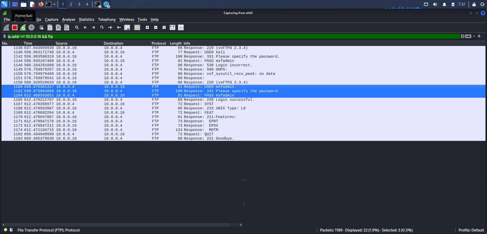<br>
<sub><b>Figure 17.</b> FTP conversation with <code>10.0.0.16</code>: 22 of 1,189 packets displayed. Banner <code>220 (vsFTPd 2.3.4)</code>; <code>USER kali</code> / <code>PASS msfadmin</code> gets <code>530 Login incorrect</code>; a new session then logs in with <code>USER msfadmin</code> (1160) and <code>PASS msfadmin</code> (1164) and gets <code>230 Login successful</code>, followed by <code>SYST</code>, <code>FEAT</code>, <code>QUIT</code> and <code>221 Goodbye</code>.</sub>
</p>

Between the two logins the first connection ended with `500 OOPS: vsf_sysutil_recv_peek: no data`. I did not investigate why.

<table>
<tr>
<td width="50%" valign="top">
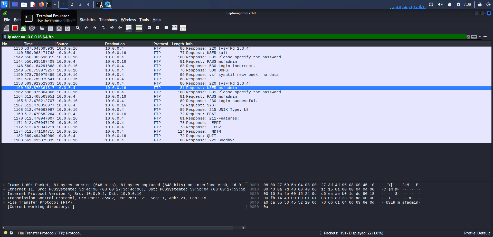<br>
<sub><b>Figure 18.</b> Packet 1160 selected: <code>USER msfadmin</code> is readable in the packet bytes. Source <code>10.0.0.4:35582</code>, destination port 21.</sub>
</td>
<td width="50%" valign="top">
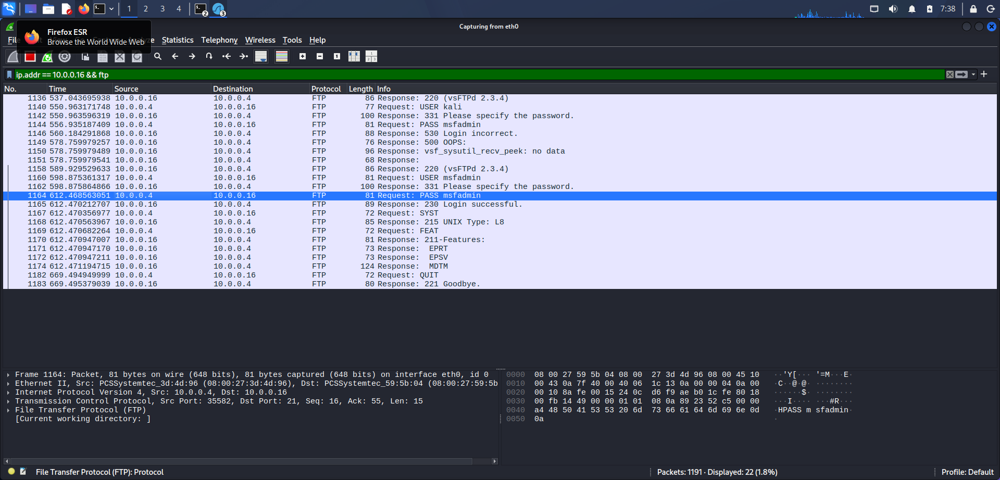<br>
<sub><b>Figure 19.</b> Packet 1164 selected: <code>PASS msfadmin</code> is readable in the packet bytes. <code>230 Login successful</code> is the next row (1165).</sub>
</td>
</tr>
</table>

Anyone able to sniff this network, for example through ARP spoofing or a compromised switch port, would read these without cracking anything. It also shows the default `msfadmin` login had never been changed.

### 3.7 Simulated data exfiltration

The goal was to produce a bulk-transfer pattern to look for in the capture. Netcat to port 4444 was tried first and refused, so the file went over the FTP service that was already open.

```bash
# attempt 1: pipe 10 MB straight to a netcat listener on the target
dd if=/dev/zero bs=1M count=10 | nc 10.0.0.16 4444
# (UNKNOWN) [10.0.0.16] 4444 (?) : Connection refused

# attempt 2: create the file, then upload it over FTP
dd if=/dev/zero of=/tmp/exfil.bin bs=1M count=10
ls -lh /tmp/exfil.bin
ftp 10.0.0.16
```

<p align="center">
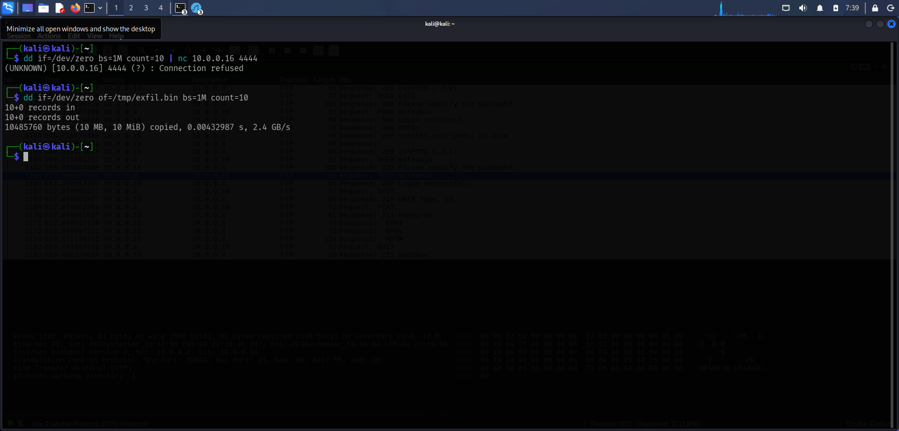<br>
<sub><b>Figure 20.</b> First, <code>dd … | nc 10.0.0.16 4444</code> fails with "Connection refused", so nothing was listening on 4444. Then <code>dd</code> writes <code>/tmp/exfil.bin</code>: 10,485,760 bytes (10 MiB). The netcat attempt did not use this file. Wireshark is dimmed in the background.</sub>
</p>

<p align="center">
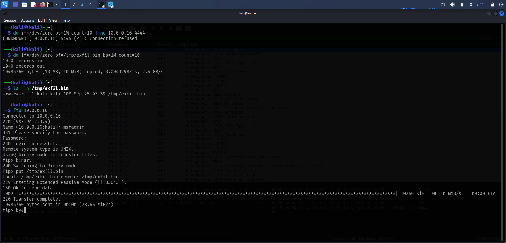<br>
<sub><b>Figure 21.</b> <code>ls -lh</code> confirms the 10M file, then an FTP login as <code>msfadmin</code>, <code>binary</code>, <code>put /tmp/exfil.bin</code> over EPSV port 33643, <code>226 Transfer complete</code>, "10485760 bytes sent in 00:00 (78.66 MiB/s)". The progress bar reads 106.50 MiB/s; 78.66 is the closing summary figure.</sub>
</p>

The key lines from Figure 21, transcribed:

```text
$ ftp 10.0.0.16
220 (vsFTPd 2.3.4)
Name (10.0.0.16:kali): msfadmin
230 Login successful.
ftp> binary
200 Switching to Binary mode.
ftp> put /tmp/exfil.bin
229 Entering Extended Passive Mode (|||33643|).
150 Ok to send data.
226 Transfer complete.
10485760 bytes sent in 00:00 (78.66 MiB/s)
ftp> bye
```

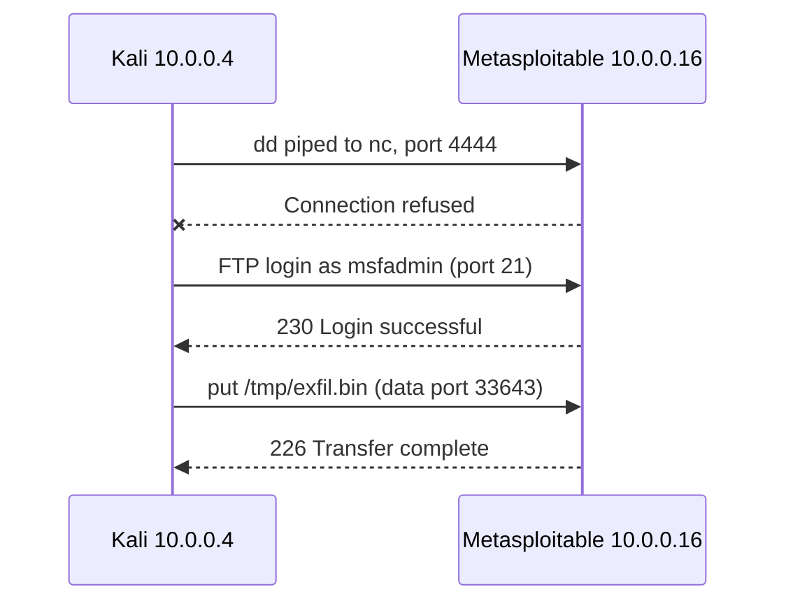
```mermaid
sequenceDiagram
    participant K as Kali 10.0.0.4
    participant T as Metasploitable 10.0.0.16
    K->>T: dd piped to nc, port 4444
    T--xK: Connection refused
    K->>T: FTP login as msfadmin (port 21)
    T-->>K: 230 Login successful
    K->>T: put /tmp/exfil.bin (data port 33643)
    T-->>K: 226 Transfer complete
```

This upload is a separate FTP login from the one in Figures 17 to 19. That session ended with `QUIT` at about 670 s without any transfer.

On the Wireshark side:

<p align="center">
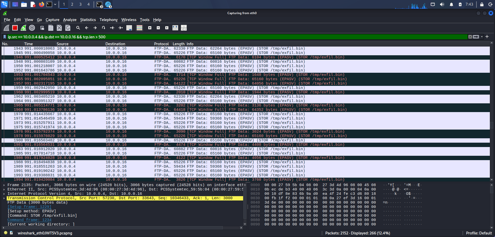<br>
<sub><b>Figure 22.</b> Filter <code>ip.src == 10.0.0.4 &amp;&amp; ip.dst == 10.0.0.16 &amp;&amp; tcp.len &gt; 500</code>: 266 of 2,152 packets (12.4%). FTP-DATA segments of up to 65,160 bytes, each labelled <code>(EPSV) (STOR /tmp/exfil.bin)</code>, around 991 s; several are flagged <code>[TCP Window Full]</code>. The detail pane shows destination port 33643.</sub>
</p>

<p align="center">
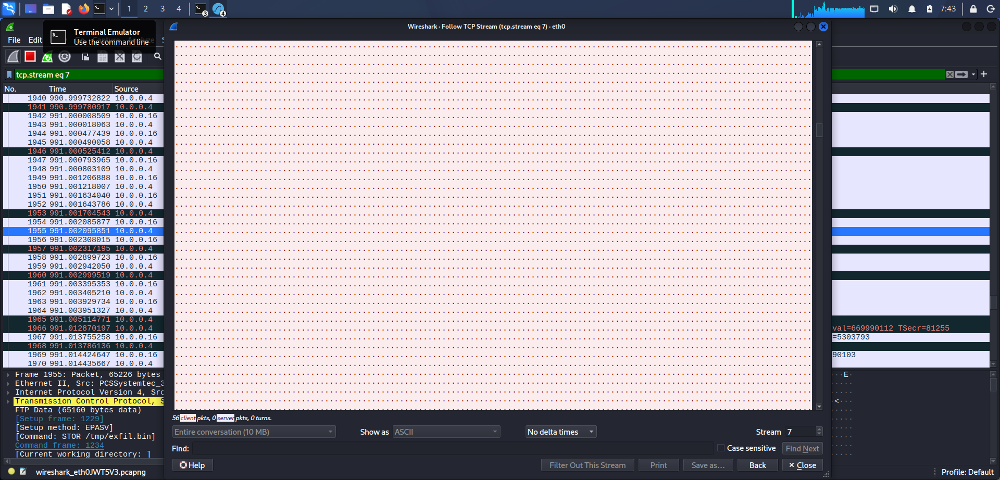<br>
<sub><b>Figure 23.</b> Follow TCP Stream, <code>tcp.stream eq 7</code>, "Entire conversation (10 MB)": 56 client packets, 0 server packets, 0 turns. The content renders as dots because the file is all zero bytes from <code>/dev/zero</code>.</sub>
</p>

What made this stand out as a bulk transfer:

- One large, one-way transfer of about 10 MB, with nothing coming back on the data stream
- Maximum-size segments sent back to back, several with `TCP Window Full`, which looks like bulk copying and not interactive use
- Data sent to an unusual FTP data port (33643, EPSV) right after a login with the default account

Because FTP does not encrypt its data channel, a real transfer of this kind would show the file's content in the same view.

### 3.8 Findings

Risk ratings are my own judgement, not tool output†.

| Finding | Evidence | Risk | Recommendation |
| --- | --- | --- | --- |
| FTP credentials sent in clear text | Figures 17 to 19 | High | Replace FTP with SFTP or FTPS; block port 21 where possible |
| Default login accepted (`msfadmin` / `msfadmin`) | Figures 18, 19 | High | Remove default accounts; require strong passwords and MFA |
| Large unencrypted FTP upload | Figures 21 to 23 | High | Egress filtering and DLP; alert on large outbound transfers; IDS/NDR |
| HTTP traffic not encrypted | Figure 16 | Medium | Enforce HTTPS with HSTS and modern TLS |
| Port-scan signature (RST/ACK burst) | Figure 12 | Medium | IDS rules for scan detection; rate-limit resets |
| Failed login followed by a successful one | Figure 17 | Medium | Account lockout; alert on repeated failures |
| Version banner exposed (vsFTPd 2.3.4) | Figure 17 | Low | Hide banners; move to a supported FTP server |
| ARP and DNS are unauthenticated | Figures 13 to 15 | Low | Dynamic ARP inspection, DNSSEC, segmentation |

### Display filters used

| Filter | Purpose | Figure |
| --- | --- | --- |
| `ip.addr == 10.0.0.16 && ftp` | Isolate the FTP conversation | 17 to 19 |
| `ip.src == 10.0.0.4 && ip.dst == 10.0.0.16 && tcp.len > 500` | Show only large segments from Kali to the target | 22 |
| `tcp.stream eq 7` (Follow TCP Stream) | Read the upload as one conversation | 23 |

---

## Limitations and open questions

- **Unauthenticated scan.** Nessus ran without credentials (Auth: Fail), so it gives no local patch results. Scanners also produce false positives and miss things. Items marked "verify" were never confirmed by hand.
- **Partial evidence.** Figure 6 shows 22 of 30 open ports. Figure 8 does not show the High count. Figure 9 stops before Nikto's summary. Statements that depend on the missing parts are marked †.
- **No exploitation.** Vulnerabilities were identified, not exploited.
- **Capture continuity.** Figure 12 shows a live capture at 87,702 packets, while Figures 13 to 23 come from `wireshark_eth0JWT5V3.pcapng` at 277 up to 2,152 packets. They appear to be different capture sessions.
- **Network isolation.** The report calls the lab isolated, but Figures 13 and 14 show the target sending DNS queries to `192.168.0.1` and pings to `142.250.190.236`. The VirtualBox network mode is not documented, so how isolated the target really was is unconfirmed.
- **Capture dates.** Nmap and Nikto timestamps say 2026-10-01. The `ls -lh` line in Figure 21 shows the file dated "Sep 25", so Task 3 may have been captured on a different day from Task 2.
- **Repeat after fixing.** In a real engagement every scan and capture would be repeated after remediation to prove the issues are closed.

## Security considerations

- The usernames and passwords in the screenshots (`msfadmin` / `msfadmin`) are the publicly known defaults of Metasploitable 2. They are not real accounts. The VNC password named in the report† is also a default of the practice VM.
- Metasploitable 2 has several unauthenticated root-level entry points. Keep it away from untrusted networks and do not expose it to the internet.
- Raw capture files and scan exports (`.pcapng`, `.nessus`, Nikto HTML) are not included. They contain full traffic and scan data, and `.gitignore` excludes them.
- Using these tools against systems without authorisation is a criminal offence in most countries, including under Pakistan's Prevention of Electronic Crimes Act, 2016†.
- The results are a point-in-time snapshot and are not a guarantee that any system is secure or insecure.

## Troubleshooting

Problems that actually showed up during the lab:

| Symptom | Cause | What fixed it |
| --- | --- | --- |
| `zypper: command not found` | Not installed on Kali | `sudo apt install zypper` (Figure 1) |
| `zsh: no such file or directory: version` | The docs' placeholder `Nessus-<version number>-debian6_amd64.deb` was pasted literally | Use the real filename, `Nessus-10.12.4-debian10_amd64.deb`, with `sudo` (Figure 2) |
| Nessus says plugins are compiling and features are limited | First run after activation | Wait for compilation to finish (Figure 4) |
| `Connection refused` from `nc 10.0.0.16 4444` | Nothing listening on that port | Used the open FTP service instead (Figures 20, 21) |
| Wireshark prints GUI warnings about an application ID when started with `sudo` | Not investigated | Nothing; the window still opened and listed `eth0` (Figure 11) |
| `500 OOPS: vsf_sysutil_recv_peek: no data` from vsFTPd | Not investigated | Reconnected; the second session worked (Figure 17) |

## Repository structure

```text
metasploitable2-vuln-assessment-packet-analysis/
├── README.md
├── LICENSE
├── .gitignore
└── docs/
    ├── report/
    │   └── Progree_Internship_Report_Muhammad_Ali_Mobeen.docx
    └── screenshots/
        ├── task2-vulnerability-assessment/   Figures 1 to 9   (T2_01 to T2_09)
        └── task3-packet-analysis/            Figures 10 to 23 (T3_01 to T3_14)
```

<details>
<summary><b>Evidence index (all 23 screenshots)</b></summary>

| Fig. | File | Shows |
| --- | --- | --- |
| 1 | `task2-…/T2_01_nessus_prerequisites_zypper_install.png` | zypper missing; `sudo apt install zypper` |
| 2 | `task2-…/T2_02_nessus_install_dpkg.png` | dpkg install of Nessus 10.12.4 |
| 3 | `task2-…/T2_03_tempmail_for_nessus_activation.png` | temp-mail.org open for the activation email |
| 4 | `task2-…/T2_04_nessus_welcome_plugins_compiling.png` | Nessus Expert first run, plugins compiling |
| 5 | `task2-…/T2_05_nessus_host_discovery_10.0.0.0-24.png` | Six hosts found in 10.0.0.0/24 |
| 6 | `task2-…/T2_06_nmap_open_ports_service_versions.png` | `nmap -sV -p- 10.0.0.16`, 22 ports visible |
| 7 | `task2-…/T2_07_nessus_scan_running.png` | Nessus scan in progress, provisional counts |
| 8 | `task2-…/T2_08_nessus_scan_completed_summary.png` | Nessus scan completed, 22 minutes |
| 9 | `task2-…/T2_09_nikto_web_scan_terminal.png` | Nikto 2.6.1 output against port 80 |
| 10 | `task3-…/T3_01_wireshark_welcome_screen.png` | Wireshark 4.6.6 welcome screen |
| 11 | `task3-…/T3_02_wireshark_launch_sudo_eth0.png` | `sudo wireshark`, eth0 highlighted |
| 12 | `task3-…/T3_03_nmap_scan_seen_in_wireshark_RST_packets.png` | RST/ACK burst, 87,702 packets |
| 13 | `task3-…/T3_04_icmp_ping_and_dns_query.png` | ICMP between lab hosts, DNS query |
| 14 | `task3-…/T3_05_icmp_and_arp_resolution.png` | ICMP to external address, ARP pair |
| 15 | `task3-…/T3_06_tcp_three_way_handshake_syn_synack_ack.png` | SYN, SYN/ACK, ACK and FIN close to port 80 |
| 16 | `task3-…/T3_07_http_get_cleartext_200ok.png` | HTTP GET and 200 OK |
| 17 | `task3-…/T3_08_ftp_filter_session_overview.png` | FTP filter, 22 of 1,189 packets |
| 18 | `task3-…/T3_09_ftp_cleartext_username.png` | Packet 1160, `USER msfadmin` |
| 19 | `task3-…/T3_10_ftp_cleartext_password.png` | Packet 1164, `PASS msfadmin` |
| 20 | `task3-…/T3_11_exfil_simulation_dd_nc_refused.png` | dd to nc refused; dd writes `/tmp/exfil.bin` |
| 21 | `task3-…/T3_12_ftp_upload_exfil_10MB_complete.png` | FTP `put`, 226 Transfer complete |
| 22 | `task3-…/T3_13_wireshark_exfil_stor_packets_filter.png` | 266 of 2,152 packets, STOR segments |
| 23 | `task3-…/T3_14_follow_tcp_stream_10MB_exfil.png` | Follow TCP Stream 7, one-way |

</details>

## Contributing

This is a finished lab write-up, not an active project. If you spot a caption that does not match its screenshot, or a technical mistake, an issue is welcome.

## Credits

Written by Muhammad Ali Mobeen as part of the Progree Remote Internship in Cyber Security. Thanks to the Progree team for the tasks and guidance. Nessus, Nmap, Nikto, Wireshark, Kali Linux, VirtualBox and Metasploitable 2 belong to their respective owners; screenshots of their interfaces are included only as evidence of the lab work.

## License

Text is licensed under [CC BY 4.0](LICENSE). Screenshots show third-party software and remain subject to their owners' terms.
